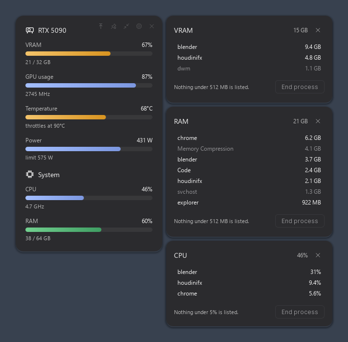

# GPU Monitor

A floating, always-on-top card showing GPU, VRAM, CPU and RAM at a
glance, wearing the look of [ia-usage](https://github.com/ivanram/ia-usage) —
which meters something else entirely, but has exactly the right shape for
this: a borderless sheet of label/value rows over pill meters.

Instantaneous readings only. There is no history graph; the card shows
what is happening right now, the way the tkinter version it replaces did.



*Double-click a row's name to see what is using it; Shift to stack
another. The readings above are made up — the picture is generated by
`docs/make_screenshot.py`, not captured from a real desktop.*

```
GPU_Monitor.bat          launch (installs PySide6/psutil if missing)
gpu_monitor.py           entry point: settings, migration, wiring
monitor/metrics.py       what can be shown and how each metric reads
monitor/sampler.py       nvidia-smi + psutil, on its own thread
monitor/gpu_pdh.py       fallback GPU readings from Windows' own counters
monitor/breakdown.py     which processes are using a meter, and ending them
monitor/winproc.py       the whole process table in one system call
monitor/processes.py     the panel a row's name opens when double-clicked
monitor/meter.py         the painted 9px bar, its row, the section header
monitor/overlay.py       the card: chrome, drag, context menu, layout
monitor/prefs.py         Preferences, extending the template's dialog
monitor/instance.py      single-instance guard: a second launch raises the first
monitor/autostart.py     the HKCU Run entry behind "start with Windows"
tests/functional.py      180 offscreen checks, no window, no pytest
ico/make_icon.py         draws the icon; --build repacks GPU_Monitor.ico
docs/                    the ia-usage design spec; the README picture and its script
vendor/app_template      bundled copy of the shared Windows template
```

`python tests\functional.py` covers the readings, the colour ramp, the
no-data and zero-reading states, the context menu, metric toggling,
opacity, always on top, the single-instance handoff, the autostart entry
and the Preferences round-trip including Cancel. The autostart checks run
against a scratch registry value name, so a test run can never touch the
real startup entry. It redirects
`LOCALAPPDATA` to a scratch folder, so it is safe to run while the real
monitor is up.

## Using it

- **Drag** anywhere on the card to move it. **Right-click** for the quick
  menu: metrics, opacity, always on top, compact, lock, quit.
- The chrome sits top-right and fades up when the pointer is on the card:
  always on top, lock position, compact layout, Preferences, quit.
- **Always on top** is on by default and re-asserted every tick, so other
  topmost windows cannot creep over the card. Toggle it from the chrome,
  the menu or Preferences. (An exclusive-fullscreen game still wins — it
  bypasses the desktop compositor entirely.)
- **Preferences** carries the shared Appearance card (palette, light /
  dark / system, accent) plus this app's metric list and overlay
  controls. Everything previews live and Cancel puts it back.
- **Opens in the middle of the main screen.** It asks Windows which
  monitor is primary *at that moment*, measures it and halves both sides,
  so it lands on the one you are looking at however many screens are
  attached. Drag it anywhere and it stays there for the rest of the
  session — nothing moves it again until the next launch. Turn *Open
  centred on the main screen* off in Preferences to go back to remembering
  where you dragged it. The right-click menu has **Centre on main screen**
  for a one-off.
- **It cannot get lost.** Windows shoves windows around when the display
  layout changes, and a card with no title bar and no taskbar button has
  nothing left to grab once it lands under a taskbar or in the dead space
  between two monitors. The card checks every second and slides back onto
  working desktop — same monitor, shortest distance — and only positions
  you dragged it to are ever remembered.
- **Only one card ever opens.** Launching it again while it is already
  running does not stack a second copy: the new process finds the running
  one through a named pipe, tells it to surface itself — brought back on
  screen if it had drifted onto a monitor no longer plugged in — and exits
  without building a window. Handy on purpose: the shortcut doubles as
  "where did my card go?".

- **Start with Windows** lives at the bottom of Preferences. It writes a
  per-user `HKCU\...\CurrentVersion\Run` entry, so it never asks for
  administrator rights, and it runs `pythonw.exe` against `gpu_monitor.py`
  directly — not the .bat, which would pip-install on a cold start while
  Windows is still logging in. Unlike everything else in the dialog it is
  applied on **Save**, not on toggle, because a registry write is not
  something Cancel could take back.

Settings live in `%LOCALAPPDATA%\GPU Monitor\settings.json`. On first run
the old `vram_monitor_config.json` is imported once — shown metrics,
position, opacity and the lock flag — and then ignored.

## What it shows

| Metric | Bar is | Colour |
|---|---|---|
| VRAM | used / total | threshold |
| GPU usage | percent | accent |
| Temperature | current / throttle point | threshold |
| Power | draw / limit | accent |
| Fan | percent (off by default) | accent |
| Core clock | current / max (off by default) | accent |
| CPU | percent | accent |
| RAM | used / total | threshold |

The **throttle point** is real, not a guess: nvidia-smi's
`temperature.gpu.tlimit` reports the degrees of headroom left, so the
limit is `current + tlimit` per board. Without it the bar falls back to a
90 °C ceiling.

**Threshold vs accent** is the one deliberate departure from ia-usage.
There, every bar means "how much of your allowance is gone", so red past
85 % is a warning. A GPU pinned at 95 % is not in trouble, it is working,
and painting that red is how you teach someone to ignore red. So the
green → amber → red ramp is kept for the metrics where filling up really
is the problem, and the rest take the accent colour. Turn
*Threshold colours* off in Preferences to make every bar the accent, which
is what ia-usage itself does the moment you pick a custom accent.

## Double-click a row's name

**Double-clicking the name** of `VRAM`, `RAM`, `GPU usage` or `CPU`
opens a list of what is using it, biggest first, grouped per executable
— one browser is fifty processes, and fifty identical rows answer
nothing. Anything under the threshold is left out -- 512 MB on the two
memory rows, 5% on the two usage ones -- so the list never adds up to
the bar: the rest is small fry plus, on VRAM, the driver's own
allocations. The panel is titled with the exact name you double-clicked,
so no two of them can be mistaken for each other.

**Shift + double-click** adds a panel instead of replacing the open one,
stacking it under the others — so you can watch VRAM, RAM, CPU and GPU
side by side. A plain double-click always collapses back to the one you
asked for, and double-clicking a name that is already open closes it, as
does the X.

The panels ride with the card: move the card and the whole stack comes
along, drag one and it keeps its new offset from then on. They take the
card's transparency too, so they read as one surface with it.

Pick one or more and **End process** closes them, after a confirmation
naming what goes. Windows' own processes are listed, because they really
are using the memory, but greyed and impossible to select: ending
`csrss` or `dwm` takes the session with it.

Video memory per process comes from `GPU Process Memory\Local Usage` --
not `Dedicated Usage`, which counts committed address space and reported
46 GB against an adapter really holding 5.6. CPU percentages are the
difference between two readings of the process table divided by the core
count, so they are on the same 0-100 scale as the card's own meter.

## How it is built

On the shared template at `C:\IA\Tools\Windows\Template`, so palette,
theme mode, accent and the settings dialog are the same controls as in
every other tool here. The ia-usage palette is a template preset
(`iausage`), not colours hardcoded in this app — its `SURFACE` is that
app's card colour verbatim, and its status colours are the endpoints of
its meter bands.

Geometry comes from [docs/ia-usage-design-spec.md](docs/ia-usage-design-spec.md),
a reverse-engineering of the WPF original with `file:line` citations: 16px
radius, 20px padding, 12px muted label against a 12px value flush right,
9px pill meter with a gradient spanning the *fill*, 11px caption, 18px
between blocks, 26px circular chrome that only fills in on hover.

Four departures the spec argues for, all implemented here: the fill
cascade runs once on the first sample and every later change is a 150 ms
tween (the original re-cascades on every render, which renders on
demand — this renders every second); a real zero keeps a 3px sliver so an
idle GPU cannot be mistaken for a dead sensor; the chrome is permanently
mounted at 0.35 opacity instead of appearing only when pinned; and
compact mode is a second set of numbers rather than a 0.75 transform,
which Qt has no clean equivalent for.

## Installing

```
git clone https://github.com/SalmeInMotion/gpu-monitor
cd gpu-monitor
pip install PySide6 psutil
python gpu_monitor.py
```

`GPU_Monitor.bat` does the same and installs the two dependencies if they
are missing. Tick *Start with Windows* at the bottom of Preferences to add
the logon entry.

The UI is built on a small shared template of mine (palette presets,
frameless chrome, settings dialog). A copy is bundled in `vendor/`, so a
clone runs on its own. It is only a fallback: if
`C:\IA\Tools\Windows\Template` exists, or `GPU_MONITOR_TEMPLATE` points
at a folder containing `app_template`, that copy wins — so on my machines
a fix to the template reaches this app without re-vendoring it.

## Which readings you get

| Source | Cards | Gives |
|---|---|---|
| `nvidia-smi` | NVIDIA | everything: VRAM, usage, temperature, power, fan, clock |
| Windows performance counters | any GPU, including AMD and Intel | usage and video memory only |

nvidia-smi is preferred wherever it answers, because it is the only source
for temperature, power, fan and clocks — Windows publishes none of them,
and reading them off an AMD card needs a vendor library this tool does not
carry. On a machine without NVIDIA the card falls back to the same
counters Task Manager uses, and the four rows it cannot measure are left
out rather than shown reading `--` forever: a row that is missing says
"not measurable here", four dead rows say "broken".

Python 3 and PySide6 are required. Without psutil the CPU and RAM rows
read `--`; with neither GPU source available the GPU block says so rather
than disappearing.
